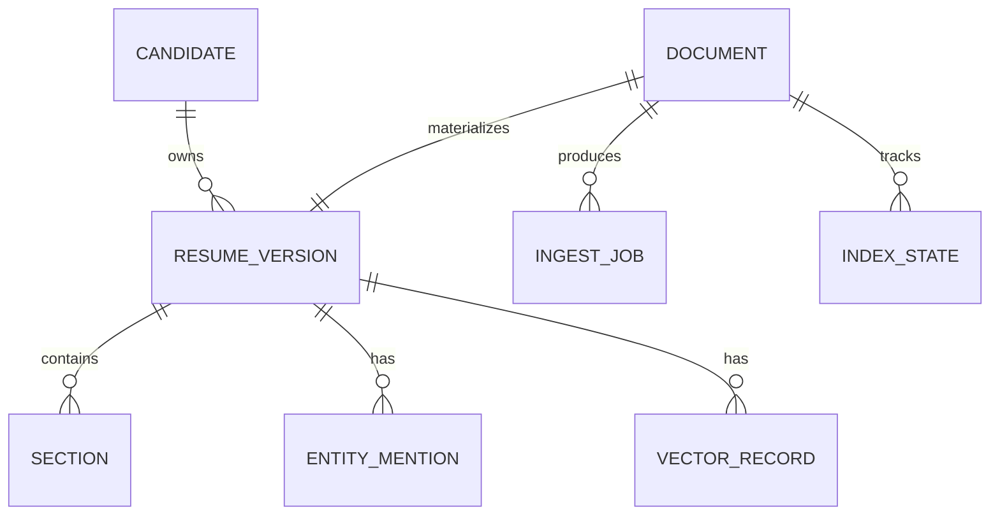

# 领域模型与字段设计

## 1. 核心对象

## 2. 对象定义

### 2.1 Document

表示一个本地文件。

| 字段 | 类型 | 必填 | 说明 | 索引用途 |
|---|---|---:|---|---|
| `doc_id` | string | 是 | 稳定文档 ID，由路径指纹或内容指纹生成 | 主键 |
| `source_uri` | string | 是 | 本地路径或逻辑 URI | 文件定位 |
| `normalized_path` | string | 是 | 规范化路径，处理大小写、分隔符、长路径 | 文件名检索 |
| `file_name` | string | 是 | 文件名 | 文件名检索 |
| `extension` | enum | 是 | docx/pdf/doc/txt/image 等 | 过滤 |
| `byte_size` | int64 | 是 | 文件大小 | 过滤/异常判断 |
| `mtime` | timestamp | 是 | 文件最后修改时间 | 增量更新 |
| `content_hash` | string | 否 | 原文件内容哈希 | 文件级去重 |
| `text_hash` | string | 否 | 规范化文本哈希 | 内容级去重 |
| `is_deleted` | bool | 是 | 文件是否已删除或不可达 | 删除传播 |
| `created_at` | timestamp | 是 | 首次发现时间 | 审计 |
| `updated_at` | timestamp | 是 | 最近处理时间 | 审计 |

### 2.2 ResumeVersion

表示某份简历的一个解析版本。一个候选人可能有多份简历，一个文件也可能重新解析出新版本。

| 字段 | 类型 | 必填 | 说明 | 索引用途 |
|---|---|---:|---|---|
| `version_id` | string | 是 | 版本 ID | 主键 |
| `doc_id` | string | 是 | 所属文件 | 关联 |
| `candidate_id` | string | 否 | 候选人聚合 ID | 去重/折叠 |
| `parse_version` | string | 是 | 解析器版本 | 质量追踪 |
| `schema_version` | string | 是 | 字段 schema 版本 | 迁移 |
| `language_set` | array | 否 | zh/en/ja 等 | 分词/排序 |
| `page_count` | int | 否 | 页数 | 异常判断 |
| `raw_text` | text | 否 | 原始抽取文本 | 全文 |
| `clean_text` | text | 否 | 清洗后文本 | 全文/embedding |
| `quality_score` | float | 否 | 解析质量评分 | 排序/诊断 |
| `visibility` | enum | 是 | searchable/partial/hidden | 查询过滤 |

### 2.3 Candidate

表示候选人级别的软聚合。系统不能假设“姓名相同就是同一个人”。

| 字段 | 类型 | 必填 | 说明 | 索引用途 |
|---|---|---:|---|---|
| `candidate_id` | string | 是 | 候选人 ID | 主键 |
| `primary_name` | string | 否 | 规范化姓名 | 搜索/展示 |
| `phone_hash` | string | 否 | 手机哈希 | 去重 |
| `email_hash` | string | 否 | 邮箱哈希 | 去重 |
| `dedupe_key` | string | 否 | 软指纹 | 版本折叠 |
| `merge_confidence` | float | 否 | 聚合置信度 | 风险提示 |
| `version_count` | int | 是 | 关联简历版本数 | 展示 |

### 2.4 Section

简历分段，用于细粒度检索和字段抽取。

| 字段 | 类型 | 必填 | 说明 | 索引用途 |
|---|---|---:|---|---|
| `section_id` | string | 是 | 段落 ID | 主键 |
| `version_id` | string | 是 | 所属简历版本 | 关联 |
| `section_type` | enum | 是 | profile/contact/education/experience/project/skill/certificate/other | 过滤/权重 |
| `order_no` | int | 是 | 原文顺序 | snippet |
| `page_no` | int | 否 | 页码 | 展示定位 |
| `text` | text | 是 | 段落文本 | 全文/向量 |
| `char_start` | int | 否 | 在 clean_text 中的起点 | 高亮 |
| `char_end` | int | 否 | 在 clean_text 中的终点 | 高亮 |
| `confidence` | float | 是 | 分段置信度 | 诊断 |

### 2.5 EntityMention

字段抽取结果采用 mention 形式保存，避免过早覆盖原始证据。

| 字段 | 类型 | 必填 | 说明 | 索引用途 |
|---|---|---:|---|---|
| `mention_id` | string | 是 | mention ID | 主键 |
| `version_id` | string | 是 | 所属版本 | 关联 |
| `section_id` | string | 否 | 所属段落 | 溯源 |
| `entity_type` | enum | 是 | name/email/phone/school/company/title/skill/cert/date/location 等 | 字段检索 |
| `raw_value` | string | 是 | 原文值 | 展示 |
| `normalized_value` | string | 否 | 规范化值 | 过滤/聚合 |
| `span_start` | int | 否 | 原文起点 | 高亮 |
| `span_end` | int | 否 | 原文终点 | 高亮 |
| `confidence` | float | 是 | 抽取置信度 | 排序/诊断 |
| `extractor` | string | 是 | 来源：规则/词典/模型/人工修正 | 审计 |

### 2.6 VectorRecord

向量记录分为文档级、段落级、字段级。

| 字段 | 类型 | 必填 | 说明 |
|---|---|---:|---|
| `vector_id` | string | 是 | 向量 ID |
| `version_id` | string | 是 | 所属简历版本 |
| `section_id` | string | 否 | 若为段落向量，则指向 section |
| `vector_scope` | enum | 是 | document/section/skill/experience |
| `model_id` | string | 是 | embedding 模型标识 |
| `dim` | int | 是 | 维度 |
| `quantization` | enum | 是 | fp32/fp16/int8/pq |
| `created_at` | timestamp | 是 | 生成时间 |

## 3. 结构化字段规范

### 3.1 联系方式字段

| 字段 | 标准化规则 | 检索策略 | 隐私策略 |
|---|---|---|---|
| `name` | 去空格、全半角归一、保留中英文 | 精确 + 模糊 | 展示可脱敏 |
| `phone` | 去分隔符、国家码归一 | 精确 | 默认哈希索引，展示脱敏 |
| `email` | 小写、去首尾空格 | 精确 | 默认哈希索引，展示脱敏 |
| `wechat` | 原样 + 小写副本 | 精确 | 脱敏 |

### 3.2 教育字段

| 字段 | 标准化规则 | 检索策略 |
|---|---|---|
| `school` | 学校别名映射、全称归一 | 精确 + 别名扩展 |
| `major` | 专业词表归一 | 关键词/字段 |
| `degree` | 博士/硕士/本科/大专/高中/未知 | 枚举过滤 |
| `school_tier` | 985/211/双一流/海外/普通/未知 | 枚举过滤 |
| `edu_start` / `edu_end` | 年月归一 | 范围过滤 |

### 3.3 工作经历字段

| 字段 | 标准化规则 | 检索策略 |
|---|---|---|
| `company` | 公司简称/全称映射 | 精确 + 别名 |
| `title` | 职位族归一 | 枚举/关键词 |
| `department` | 原文保留 | 关键词 |
| `work_start` / `work_end` | 年月归一，至今特殊处理 | 范围过滤 |
| `years_experience` | 时间段推导 | 数值过滤 |
| `industry` | 公司/项目/关键词推断 | 枚举过滤 |

### 3.4 技能字段

| 字段 | 标准化规则 | 检索策略 |
|---|---|---|
| `skill_raw` | 原文技能 | 全文 |
| `skill_norm` | 技能词典归一，如 JS -> JavaScript | 多值字段过滤 |
| `skill_category` | backend/frontend/data/ai/devops/security/product 等 | facet |
| `skill_evidence` | 技能出现位置：技能段/项目段/工作段 | 加权排序 |
| `skill_confidence` | 规则和模型综合置信度 | 排序/诊断 |

### 3.5 证书和资质字段

| 字段 | 标准化规则 | 检索策略 |
|---|---|---|
| `certificate` | 证书名别名归一 | 精确 + 别名 |
| `certificate_level` | 初级/中级/高级/未知 | 枚举过滤 |
| `certificate_date` | 年月归一 | 范围过滤 |

## 4. 字段置信度

所有关键字段必须带置信度。

| 置信度区间 | 含义 | 处理方式 |
|---:|---|---|
| `>=0.95` | 强规则命中或多证据一致 | 可直接用于过滤和展示 |
| `0.75-0.95` | 高可信模型/规则联合结果 | 可用于检索，展示可标注 |
| `0.50-0.75` | 弱证据 | 只用于召回，不用于强过滤 |
| `<0.50` | 噪音或不确定 | 默认不入结构化字段，只保留原文 |

## 5. ID 设计

| ID | 生成建议 | 稳定性 |
|---|---|---|
| `doc_id` | 规范化路径 + 文件大小 + mtime 的快速指纹；有 hash 后升级为内容指纹 | 文件移动时可能变化 |
| `version_id` | `doc_id + content_hash + parse_version + schema_version` | 稳定 |
| `candidate_id` | 联系方式强指纹优先；无联系方式时使用软聚合 ID | 可变，需要 merge 记录 |
| `section_id` | `version_id + section_type + order_no + text_hash_prefix` | 稳定 |
| `vector_id` | `version_id/section_id + model_id + quantization` | 稳定 |

## 6. 软去重规则

候选人级去重不能只靠单字段。推荐证据组合：

| 证据 | 权重 |
|---|---:|
| 手机完全一致 | 极高 |
| 邮箱完全一致 | 极高 |
| 姓名 + 手机后 4 位 | 高 |
| 姓名 + 邮箱前缀 | 高 |
| 姓名 + 学校 + 最近公司 | 中 |
| 姓名 + 技能 + 时间线相似 | 低 |

输出时必须保留“同一候选人的多个简历版本”，不能简单删除旧版本。
