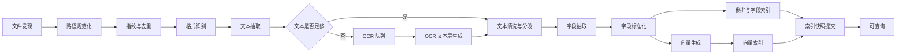
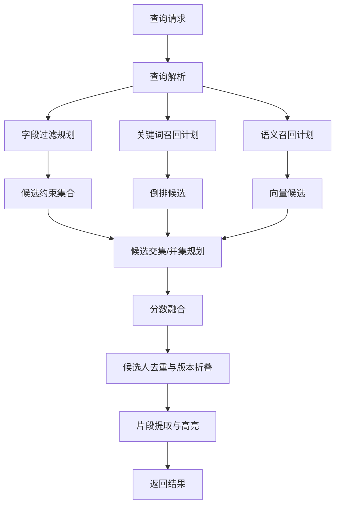
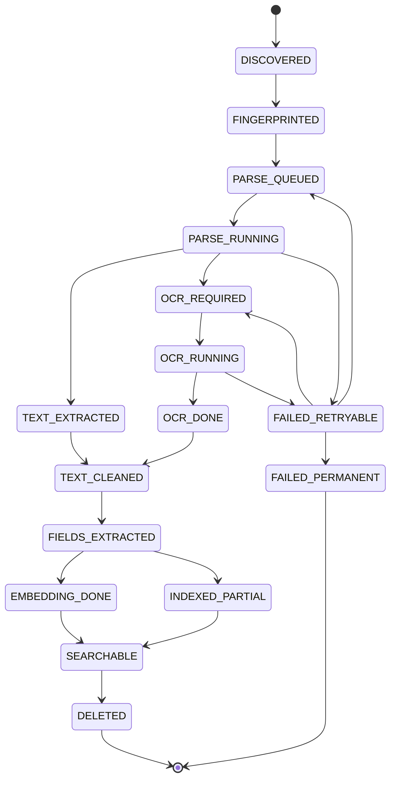

# 数据流与状态机

## 1. 总体数据流

## 2. 查询数据流

查询链路只读取已提交快照，不等待后台导入。

## 3. 文档生命周期状态

| 状态 | 含义 | 可恢复动作 |
|---|---|---|
| `DISCOVERED` | 发现文件 | 排队 fingerprint |
| `FINGERPRINTED` | 已生成路径/内容指纹 | 排队解析 |
| `PARSE_QUEUED` | 等待解析 | 可取消/调度 |
| `PARSE_RUNNING` | 正在解析 | 超时后重试 |
| `TEXT_EXTRACTED` | 已抽取文本 | 分段/字段抽取 |
| `OCR_REQUIRED` | 文本不足，需要 OCR | 排队 OCR |
| `OCR_RUNNING` | 正在 OCR | 可暂停/限流 |
| `OCR_DONE` | OCR 完成 | 文本清洗 |
| `TEXT_CLEANED` | 文本已清洗分段 | 字段抽取 |
| `FIELDS_EXTRACTED` | 字段已抽取 | 标准化/向量 |
| `EMBEDDING_DONE` | 向量已生成 | 向量索引 |
| `INDEXED_PARTIAL` | 部分索引完成 | 可部分查询 |
| `SEARCHABLE` | 全部索引完成 | 正常查询 |
| `FAILED_RETRYABLE` | 临时失败 | 延迟重试 |
| `FAILED_PERMANENT` | 永久失败 | 记录原因，允许人工重试 |
| `DELETED` | 文件删除 | 索引删除标记 |

## 4. 状态机

## 5. 任务优先级

| 优先级 | 任务 | 原因 |
|---:|---|---|
| P0 | 查询、状态查询、取消任务 | 用户交互优先 |
| P1 | 文件名/元数据入库 | 先让文件可见 |
| P2 | 文本层解析 | 大多数 Word/PDF 可快速完成 |
| P3 | 字段抽取 | 结构化检索必需 |
| P4 | 向量生成 | 语义检索需要，但可延迟 |
| P5 | OCR | 最重，必须限流 |
| P6 | 索引合并、重建、质量重算 | 后台低优先级 |

## 6. 背压机制

系统必须根据本机资源动态调整任务吞吐。

| 信号 | 动作 |
|---|---|
| 查询 P95 超过阈值 | 降低导入线程数，暂停 OCR |
| CPU 持续高于阈值 | 暂停向量生成和 OCR |
| 内存接近上限 | 减小 batch，关闭片段缓存，延迟索引合并 |
| 磁盘队列过长 | 降低扫描速度，批量提交索引 |
| 电池模式 | 只保留 P0-P2，暂停 P3+ |
| 用户正在活跃输入 | 降低后台线程优先级 |

## 7. 删除与更新传播

文件变更处理：

1. 路径变更但内容 hash 一致：视为移动或重命名，更新路径，不重新 OCR。
2. mtime 变化但内容 hash 一致：只更新元数据。
3. 内容 hash 变化：生成新版本，旧版本保留或按策略折叠。
4. 文件删除：写删除标记，查询默认隐藏，后台延迟清理 segment。
5. 文件不可访问：进入 `FAILED_RETRYABLE`，不立即删除。

## 8. 快照提交

索引提交应遵循：

1. 写入临时快照目录。
2. 校验快照完整性。
3. 原子切换当前快照指针。
4. 通知查询 reader reload。
5. 延迟回收旧快照。

这样即使导入中断，也不会破坏已可查询的旧索引。
