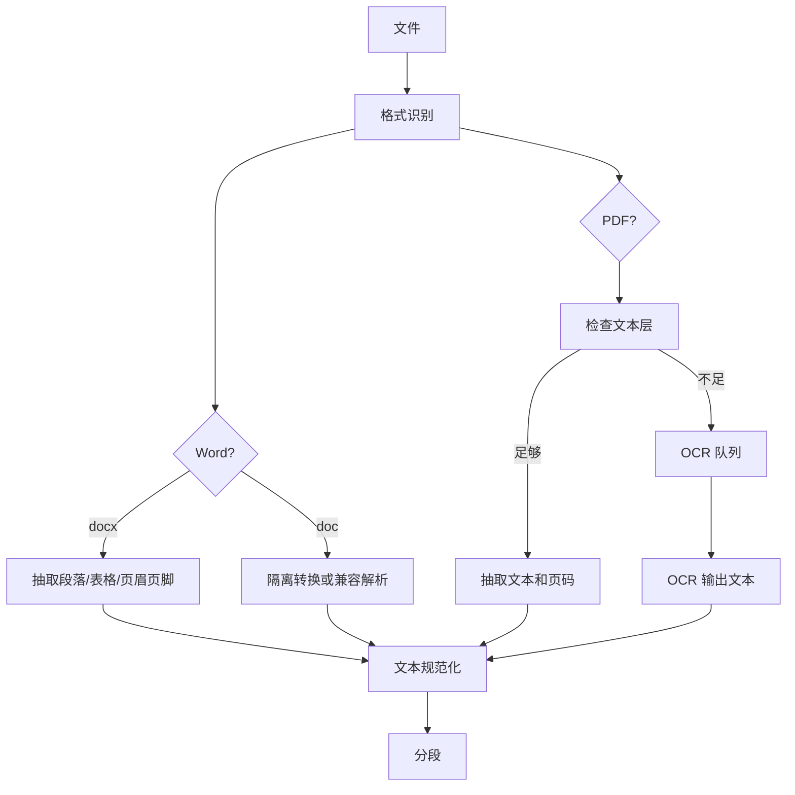

# 导入解析与 OCR 流程

## 1. 输入分类

导入入口必须先做轻量识别，不要直接开重解析器。

| 输入 | 判定方式 | 处理路径 |
|---|---|---|
| 文件夹 | 遍历 + 过滤扩展名 + 忽略规则 | 文件发现队列 |
| 压缩包解压目录 | 同文件夹 | 文件发现队列 |
| `.docx` | 扩展名 + 文件头 | Word 解析 |
| `.doc` | 扩展名 + 文件头 | 兼容解析或隔离转换 |
| 文本层 PDF | PDF 元数据 + 每页文本字符数 | PDF 文本抽取 |
| 扫描 PDF | 页面文本少 + 图像覆盖高 | OCR 队列 |
| 图片型 PDF | 页面基本无文本，整页图片 | OCR 队列 |
| 损坏文件 | 解析失败 | 错误状态 |
| 加密文件 | 需要密码 | 永久失败或人工处理 |

## 2. 导入阶段

### 2.1 文件发现

文件发现只做便宜操作：

1. 枚举路径。
2. 规范化路径。
3. 读取基础属性：大小、mtime、权限。
4. 按扩展名和文件头初筛。
5. 写入发现状态。

不在这一阶段读取整个文件内容，避免扫描百万文件时拖慢机器。

### 2.2 指纹计算

指纹分两层：

| 指纹 | 用途 | 成本 |
|---|---|---|
| 快速指纹 | 路径、大小、mtime、头尾采样 | 低 |
| 内容指纹 | 全文件 hash | 中/高 |
| 文本指纹 | 规范化文本 hash | 中 |

策略：

1. 首次导入可先使用快速指纹入队。
2. 后台补全内容指纹。
3. 若文件很大，采用分块读取，避免一次性占用内存。

## 3. 文本抽取流程

## 4. PDF 是否需要 OCR 的判定

禁止对所有 PDF 无脑 OCR。判定规则建议组合使用：

| 信号 | 判定 |
|---|---|
| 每页可抽取字符数 `<20` | 倾向 OCR |
| 页面图像覆盖面积 `>70%` | 倾向 OCR |
| 文本 bbox 极少但图片对象很多 | 倾向 OCR |
| 字符乱码比例高 | 可能需要 OCR 或编码修复 |
| 页面已有可搜索文本层 | 不 OCR |
| 只有少量页无文本 | 只 OCR 缺失页面 |

## 5. OCR 策略

OCR 是最重链路，必须独立队列、可暂停、可限流、可缓存。

### 5.1 OCR 分级

| 档位 | 触发条件 | 处理方式 |
|---|---|---|
| 关闭 | 用户低配机器或电池模式 | 只记录 OCR_REQUIRED |
| 经济 | 后台空闲、单线程 | 只处理 top priority 文件 |
| 平衡 | 插电、CPU 空闲 | 小批量页面并行 |
| 高速 | 用户主动全量导入 | 多进程/多线程，严格内存上限 |

### 5.2 OCR 缓存

缓存键：`file_content_hash + page_no + render_dpi + ocr_lang + ocr_profile`。

缓存内容：

1. 页面 OCR 文本。
2. 文字 bbox。
3. 置信度。
4. OCR 耗时。
5. 错误码。

文件未变化时不重复 OCR。

### 5.3 OCR 输出要求

OCR 结果不能只保存拼接文本，还要保存页码和位置证据：

| 字段 | 说明 |
|---|---|
| `page_no` | 页码 |
| `text` | OCR 文本 |
| `bbox_list` | 可选，文字位置 |
| `confidence` | OCR 置信度 |
| `engine_profile` | OCR 配置 |
| `duration_ms` | 耗时 |

## 6. 文本清洗

文本清洗目标是提高检索和字段抽取质量，不是重写简历。

清洗规则：

1. 统一换行和空白。
2. 去除重复页眉页脚。
3. 修复常见 OCR 空格噪音。
4. 保留项目符号和时间段信息。
5. 保留原文 offset 映射，便于高亮。
6. 中英文混排不强行翻译。
7. 表格文本按行列顺序尽可能线性化。

## 7. 分段策略

优先按简历语义分段：

| 段类型 | 触发信号 |
|---|---|
| `contact` | 手机、邮箱、微信、地址 |
| `profile` | 自我评价、个人简介、求职意向 |
| `education` | 教育经历、学校、专业、学历 |
| `experience` | 工作经历、公司、职位、时间段 |
| `project` | 项目经历、项目名称、职责、业绩 |
| `skill` | 技能、技术栈、熟悉、掌握 |
| `certificate` | 证书、资格、认证 |
| `other` | 无法识别段 |

分段失败时，必须退化为基于长度和段落的 chunk，保证全文和语义索引仍可用。

## 8. 字段抽取顺序

字段抽取建议先强规则、再词典、再模型、最后冲突合并：

1. 联系方式：规则优先。
2. 日期和时间段：规则优先。
3. 学校、公司、证书、技能：词典 + 别名表。
4. 职位、职责、项目领域：规则 + 轻量模型。
5. 工作年限、最近公司、最高学历：字段推导。
6. 冲突字段保留多候选和置信度。

## 9. 输入异常处理

| 异常 | 行为 |
|---|---|
| 文件被占用 | 延迟重试 |
| 文件太大 | 只做元数据，等待用户确认或后台低优先级处理 |
| PDF 加密 | 标记需要密码，不进入 OCR |
| PDF 损坏 | 尝试修复；失败后永久失败 |
| Word 内嵌图片 | 若文本不足，可按图片 OCR 策略处理 |
| 双栏简历 | 尝试版面顺序修正，失败时保留原始顺序 |
| 表格简历 | 表格线性化，字段抽取需保留单元格邻近关系 |
| 中英混排 | 分词和标准化都要保留语言标签 |
| 同一文件反复变化 | 合并变更事件，避免重复导入 |
