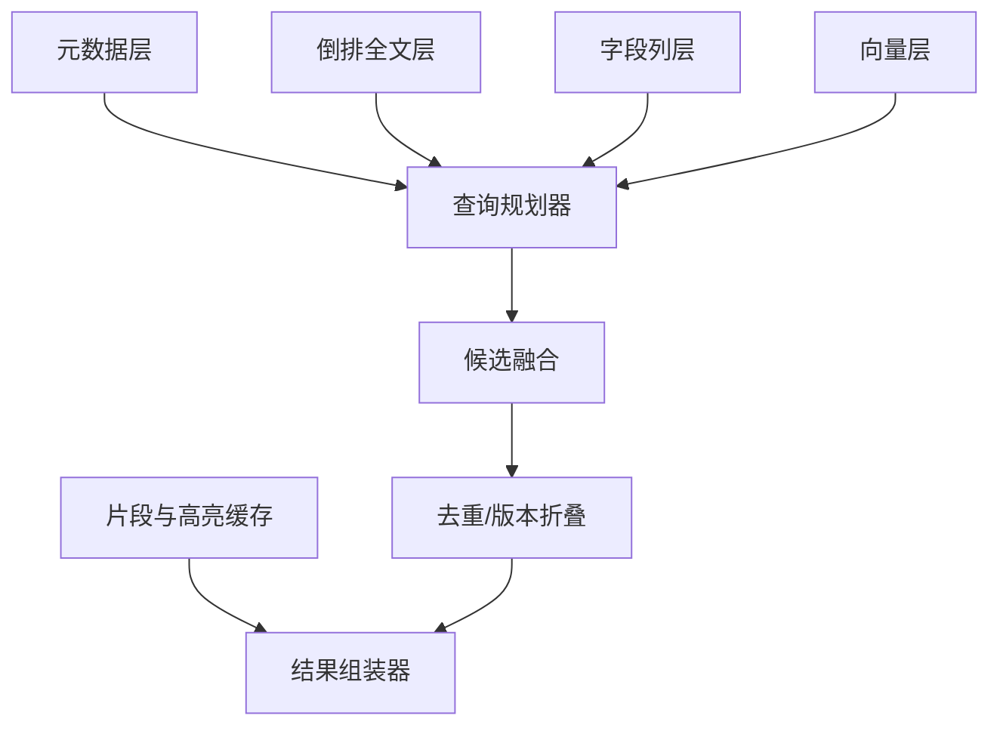
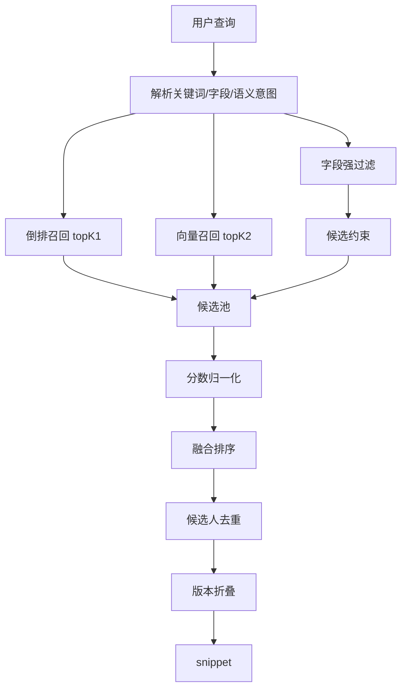

# 索引与检索设计

## 1. 索引分层



| 索引层 | 保存内容 | 主要查询 |
|---|---|---|
| 元数据层 | 文件、版本、任务、状态、错误、配置 | 状态、过滤、恢复 |
| 倒排全文层 | 文件名、全文、段落、字段文本 | 关键词、短语、布尔 |
| 字段列层 | 数值、枚举、时间、多值字段 | 年限、学历、地区、技能过滤 |
| 向量层 | 文档级和段落级向量 | 语义召回、相似简历 |
| 缓存层 | snippet、OCR 页面、embedding 中间结果 | 加速结果组装 |

## 2. 分片策略

百万级本地索引不应只有一个巨型活动写入区。

推荐逻辑分片：

| 分片方式 | 优点 | 使用场景 |
|---|---|---|
| 按 hash 均匀分片 | 写入和查询分散 | 默认策略 |
| 按来源目录分片 | 便于迁移和删除 | 多数据源场景 |
| 按时间分片 | 便于冷数据管理 | 简历按批次导入 |
| 小库单分片 | 简单 | 10 万以内 |

查询时对多个分片并行召回，然后在融合层做 topK merge。

## 3. 写入与读取隔离

索引写入流程：

1. 任务批量生成索引文档。
2. 写入 staging segment。
3. 提交 segment。
4. 更新快照元信息。
5. 查询 reader 延迟 reload。
6. 旧 segment 按引用计数回收。

读取流程：

1. 查询拿到当前快照指针。
2. 打开只读 reader。
3. 在当前快照内完成召回。
4. 返回后释放 reader。

不得让查询线程等待索引合并完成。

## 4. 字段索引策略

| 字段类型 | 索引策略 |
|---|---|
| 文本 | 倒排索引，支持分词、短语、布尔 |
| 枚举 | 字段列 + facet |
| 数值 | 字段列 + 范围过滤 |
| 时间 | 归一为年月或时间戳，支持范围 |
| 多值 | 多值字段，支持 contains/any/all |
| 置信度 | 数值字段，用于过滤和排序 |
| 隐私字段 | 哈希索引 + 展示脱敏 |

## 5. 检索模式

### 5.1 文件名检索

目标：快速定位文件。

排序信号：

1. 文件名精确命中。
2. 文件名前缀命中。
3. 路径命中。
4. 最近修改时间。
5. 是否 searchable。

### 5.2 全文检索

目标：关键词、短语、布尔条件准确召回。

排序信号：

1. 词项匹配分数。
2. 命中段权重：技能段、工作段、项目段权重更高。
3. 字段置信度。
4. 简历质量分。
5. 版本新旧。

### 5.3 结构化检索

例子：

```text
学历 >= 本科 AND 技能包含 Java AND 工作年限 >= 3 AND 最近公司行业 = 支付
```

结构化过滤必须先于重排序执行，避免无意义地处理大量不可能候选。

### 5.4 语义检索

用于解决措辞不一致问题：

| 用户表达 | 简历可能表达 |
|---|---|
| 支付网关经验 | 对接收单、清结算、渠道路由 |
| ToB 风控平台 | 企业客户反欺诈、规则引擎、风险策略 |
| 数据治理 | 主数据、指标口径、数据质量、血缘 |

语义检索只负责召回，不应单独决定最终排序。

### 5.5 混合检索

混合检索流程：



推荐融合信号：

| 信号 | 作用 |
|---|---|
| 关键词分数 | 精确匹配和短语匹配 |
| 向量相似度 | 语义召回 |
| 字段满足度 | 强条件匹配 |
| 段落权重 | 命中位置质量 |
| 简历质量分 | 解析可信度 |
| 新鲜度 | 最近版本优先 |
| 去重惩罚 | 同候选人多版本折叠 |

## 6. RRF 融合

可以使用倒数排名融合：

```text
score(doc) = Σ 1 / (k + rank_i(doc))
```

其中：

- `rank_i` 是文档在某个召回通道的排名。
- `k` 控制排名衰减，一般 40-100。
- 强过滤条件不参与融合，先过滤。

RRF 的好处是不同召回通道分数尺度不同也能融合。

## 7. 结果去重与版本折叠

排序后按候选人折叠：

1. 同一候选人只展示最佳版本。
2. 允许展开查看历史版本。
3. 若候选人合并置信度低，不强折叠，只提示“疑似同人”。
4. 删除版本默认隐藏，但保留审计状态。

## 8. snippet 和高亮

结果展示只对 topN 做 snippet，不对全量候选生成摘要。

snippet 来源优先级：

1. 命中关键词附近窗口。
2. 命中字段所在段落。
3. 向量命中的 section。
4. 简历摘要段。
5. 文件名和元数据兜底。

## 9. 查询预算

每次查询必须有预算，防止极端 query 拖垮机器。

| 预算项 | 默认建议 |
|---|---:|
| 最大召回分片数 | 全部热分片，冷分片可延迟 |
| 倒排 topK | 1000-5000 |
| 向量 topK | 200-1000 |
| 融合候选数 | 1000-3000 |
| snippet 数 | 20-100 |
| 最大响应大小 | 可配置 |
| 查询超时 | 软超时 + 部分结果 |

## 10. 冷启动策略

启动时不要一次性加载全部内容。

顺序：

1. 加载元数据和快照指针。
2. 打开倒排 reader。
3. 延迟加载向量入口或 mmap。
4. 预热最近查询字段和常用词典。
5. 后台校验索引健康。

系统应在“能回答文件名和基础全文查询”后尽快进入可用状态，再逐步预热重索引层。
