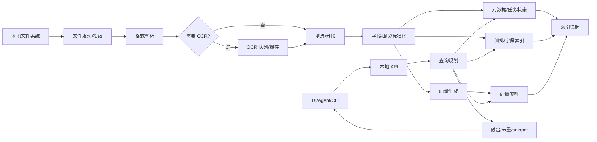

# 一页版架构图

```mermaid
flowchart LR
    FS[本地文件系统] --> DISC[文件发现/指纹]
    DISC --> PARSE[格式解析]
    PARSE --> OCR{需要 OCR?}
    OCR -- 否 --> CLEAN[清洗/分段]
    OCR -- 是 --> OCRQ[OCR 队列/缓存]
    OCRQ --> CLEAN
    CLEAN --> EXT[字段抽取/标准化]
    EXT --> META[元数据/任务状态]
    EXT --> FTS[倒排/字段索引]
    EXT --> EMB[向量生成]
    EMB --> VEC[向量索引]
    META --> SNAP[索引快照]
    FTS --> SNAP
    VEC --> SNAP
    AGENT[UI/Agent/CLI] --> API[本地 API]
    API --> PLAN[查询规划]
    PLAN --> FTS
    PLAN --> VEC
    PLAN --> META
    PLAN --> FUSE[融合/去重/snippet]
    FUSE --> AGENT
```

一句话：**导入慢链路后台做，查询热链路只读索引快照。**
