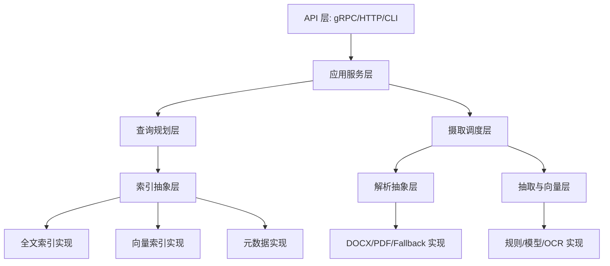
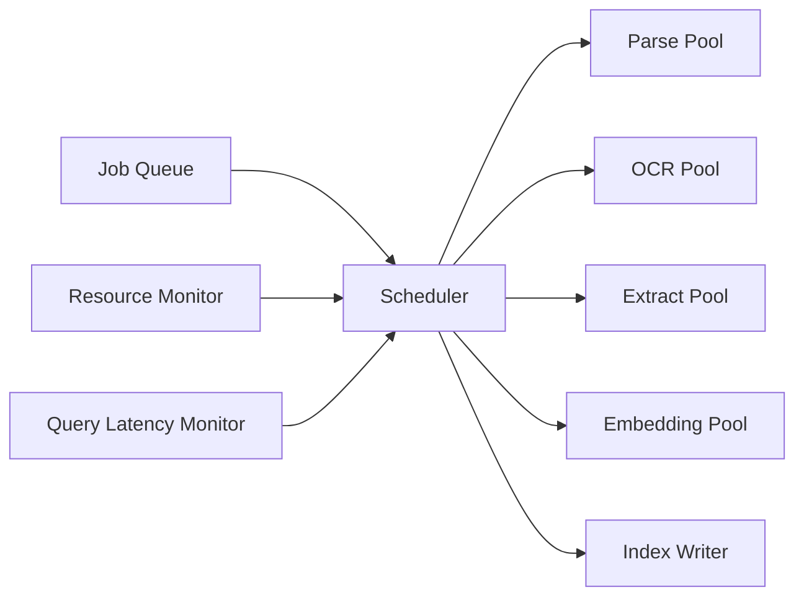

# 模块分层与解耦

## 1. 分层图



依赖方向只能从上到下，不能反向依赖。

## 2. 核心接口

### 2.1 DocumentSource

```rust
trait DocumentSource {
    fn scan(&self, root: SourceRoot) -> Stream<DocumentEvent>;
    fn stat(&self, uri: &DocumentUri) -> Result<FileStat>;
    fn open(&self, uri: &DocumentUri) -> Result<DocumentReadHandle>;
}
```

实现：本地文件系统、测试 fixture、未来导入包。

### 2.2 Parser

```rust
trait Parser {
    fn supports(&self, probe: &FileProbe) -> SupportLevel;
    fn parse(&self, input: ParseInput, budget: ResourceBudget) -> Result<ParseOutput>;
}
```

Parser 不允许写数据库、不允许写索引。

### 2.3 OcrEngine

```rust
trait OcrEngine {
    fn recognize_page(&self, page: RenderedPage, options: OcrOptions) -> Result<OcrPage>;
}
```

OCR 通过 worker client 实现，不直接在主查询线程执行。

### 2.4 Extractor

```rust
trait Extractor {
    fn extract(&self, doc: &CleanDocument, dicts: &Dictionaries) -> Result<Vec<EntityMention>>;
}
```

可组合：规则 extractor、词典 extractor、模型 extractor、字段推导器。

### 2.5 Embedder

```rust
trait Embedder {
    fn embed_batch(&self, inputs: &[EmbeddingInput], budget: ResourceBudget) -> Result<Vec<VectorRecord>>;
}
```

Embedder 必须支持 batch、取消和资源预算。

### 2.6 FulltextIndex

```rust
trait FulltextIndex {
    fn index_batch(&self, docs: Vec<IndexDocument>) -> Result<CommitToken>;
    fn search(&self, query: FulltextQuery, budget: QueryBudget) -> Result<Vec<ScoredDoc>>;
    fn snapshot(&self) -> Result<IndexSnapshot>;
}
```

### 2.7 VectorIndex

```rust
trait VectorIndex {
    fn upsert(&self, vectors: Vec<VectorRecord>) -> Result<CommitToken>;
    fn mark_deleted(&self, vector_ids: &[VectorId]) -> Result<()>;
    fn knn(&self, query: QueryVector, k: usize, budget: QueryBudget) -> Result<Vec<VectorHit>>;
    fn snapshot(&self) -> Result<VectorSnapshot>;
}
```

### 2.8 MetadataStore

```rust
trait MetadataStore {
    fn begin_tx(&self) -> Result<Tx>;
    fn get_document(&self, doc_id: &DocId) -> Result<Option<Document>>;
    fn update_job_state(&self, job_id: &JobId, state: JobState) -> Result<()>;
    fn list_retryable_jobs(&self, limit: usize) -> Result<Vec<IngestJob>>;
}
```

## 3. 解耦原则

| 原则 | 说明 |
|---|---|
| parser 不知道 index | 解析只输出结构，不写索引 |
| extractor 不知道存储 | 抽取只输出 mention |
| index 不知道 OCR | 索引只吃标准化数据 |
| API 不知道具体引擎 | API 调用应用服务层 |
| worker 不信任输入路径 | 只处理主进程授予的临时文件 |
| 所有重任务可取消 | 导入、OCR、embedding、合并都要响应取消 |

## 4. 错误模型

统一错误类型：

```text
ErrorKind:
  ConfigError
  IoError
  PermissionDenied
  UnsupportedFormat
  EncryptedDocument
  CorruptedDocument
  ParserTimeout
  OcrTimeout
  ModelError
  IndexCorrupted
  SchemaMismatch
  ResourceExhausted
  Cancelled
  InternalBug
```

每个错误必须包含：

1. `kind`
2. `retryable`
3. `user_message`
4. `diagnostic_message`
5. `redaction_level`
6. `source_component`

## 5. 资源预算

所有重操作都传入预算：

```text
ResourceBudget:
  max_cpu_threads
  max_memory_mb
  deadline
  max_temp_bytes
  priority
  cancellation_token
```

预算由调度器根据当前 profile 和系统负载生成。

## 6. 任务调度



调度器根据：

1. 任务优先级。
2. 当前 CPU/内存/磁盘。
3. 查询 P95。
4. 电池状态。
5. 用户设置。
6. 队列积压。

动态发放 permits。

## 7. 快照接口

全文、向量和元数据都要有快照 manifest：

```json
{
  "snapshot_id": "snap_20260530_001",
  "created_at": "2026-05-30T12:00:00Z",
  "schema_versions": {
    "meta": 5,
    "fts": 3,
    "vector": 2
  },
  "segments": [
    {"path": "fts/seg_001", "checksum": "..."},
    {"path": "vector/hnsw_001", "checksum": "..."}
  ],
  "document_count": 1000000,
  "deleted_count": 1234
}
```

查询只使用 manifest 指向的完整快照。

## 8. 插件与替换点

以下模块必须可替换：

| 模块 | 替换原因 |
|---|---|
| PDF parser | 不同 PDF 库兼容性差异 |
| OCR engine | 平台 OCR 或商业 OCR 替换 |
| embedding model | 模型升级和量化版本 |
| vector index | HNSWlib -> FAISS |
| tokenizer | 中文、英文、日文分词差异 |
| dictionaries | 行业词典长期迭代 |

替换点通过 trait + feature flag + runtime config 管理。

## 9. 日志和追踪边界

日志字段允许：

1. doc_id。
2. job_id。
3. 耗时。
4. 状态。
5. 错误码。
6. 文件扩展名。
7. 文件大小。

日志字段禁止：

1. 完整路径默认明文。
2. 手机号。
3. 邮箱。
4. 简历原文。
5. OCR 全文。
6. 模型输入全文。

调试模式也要红线脱敏。
