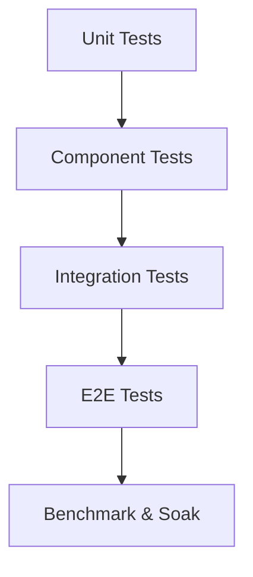

# 测试、基准与验收

## 1. 测试金字塔



| 层级 | 内容 | 频率 |
|---|---|---|
| Unit | ID、字段标准化、规则抽取、query parser | 每 PR |
| Component | parser、OCR client、index writer、vector wrapper | 每 PR |
| Integration | 导入到检索闭环 | 每 PR 小集 |
| E2E | Windows/macOS 安装后导入查询 | 每日/发布 |
| Benchmark | 10 万/100 万语料性能 | 夜间/发布前 |
| Soak | 长时间导入、崩溃恢复 | 发布前 |

## 2. Golden tests

### 2.1 Parser golden

每个 fixture 包含：

```text
fixtures/parser/docx/simple_resume.docx
fixtures/parser/docx/simple_resume.expected.json
fixtures/parser/pdf/text_layer.pdf
fixtures/parser/pdf/text_layer.expected.json
fixtures/parser/pdf/scanned.pdf
fixtures/parser/pdf/scanned.expected.json
```

expected 内容：

1. 页面数。
2. 文本片段。
3. 表格线性化结果。
4. OCR 判定。
5. 错误码。

### 2.2 Extractor golden

样例：

```json
{
  "input": "2019.09-2023.06 浙江大学 计算机科学 本科",
  "expected_mentions": [
    {"type": "school", "normalized": "浙江大学"},
    {"type": "major", "normalized": "计算机科学"},
    {"type": "degree", "normalized": "bachelor"},
    {"type": "date_range", "start": "2019-09", "end": "2023-06"}
  ]
}
```

## 3. 性能基准

### 3.1 查询基准

查询集：

| 类型 | 数量 | 示例 |
|---|---:|---|
| 文件名 | 200 | `张三 Java` |
| 关键词 | 500 | `支付 网关 清结算` |
| 字段 | 300 | `本科 AND Java AND 3年` |
| 语义 | 300 | `做过 ToB 风控平台的后端` |
| 混合 | 500 | `985 本科 + Java + 跨境支付 + 中级证书` |
| 极端 | 100 | 超长、错别字、互斥条件、冷词 |

输出指标：

1. P50/P95/P99。
2. QPS。
3. CPU。
4. RSS。
5. 磁盘读。
6. topK 质量。
7. partial 率。

### 3.2 导入基准

| 数据集 | 用途 |
|---|---|
| 1 万 docx | 快速 parser 回归 |
| 1 万 PDF 文本层 | PDF 文本抽取性能 |
| 1 千扫描 PDF | OCR 性能和稳定性 |
| 10 万混合 | 日常夜间压测 |
| 100 万混合 | 发布前容量验证 |

### 3.3 向量基准

指标：

1. build time。
2. index size。
3. recall@10。
4. query latency。
5. memory peak。
6. update/delete cost。
7. snapshot load time。

## 4. 质量评估

### 4.1 字段抽取

字段 F1 目标初始建议：

| 字段 | MVP 目标 | 生产目标 |
|---|---:|---:|
| email | 0.98 | 0.995 |
| phone | 0.98 | 0.995 |
| school | 0.85 | 0.93 |
| degree | 0.88 | 0.95 |
| company | 0.80 | 0.90 |
| title | 0.75 | 0.88 |
| skills | 0.80 | 0.92 |
| date range | 0.85 | 0.93 |

### 4.2 检索质量

| 指标 | MVP | 生产 |
|---|---:|---:|
| keyword Recall@20 | 0.90 | 0.96 |
| hybrid Recall@20 | 0.85 | 0.93 |
| MRR@10 | 0.70 | 0.82 |
| NDCG@10 | 0.75 | 0.85 |

这些数值需要结合真实招聘业务 query 调整。

## 5. 故障注入

必须测试：

1. 导入中 kill daemon。
2. OCR worker 崩溃。
3. 磁盘空间不足。
4. 文件被删除。
5. 文件被锁定。
6. 索引快照损坏。
7. 元数据迁移失败。
8. 模型文件 checksum 不匹配。
9. 电池模式切换。
10. 外接盘断开。

## 6. 跨平台测试

### Windows

覆盖：

1. 长路径。
2. 中文路径。
3. 文件被占用。
4. 杀毒软件干扰。
5. user-mode daemon。
6. MSI 安装/升级/卸载。
7. Named Pipe 或 loopback 调用。

### macOS

覆盖：

1. Apple Silicon。
2. Intel Mac，如仍支持。
3. Gatekeeper。
4. 签名和 notarization。
5. LaunchAgent。
6. sandbox 权限提示。
7. 中文路径和 iCloud 同步目录。

## 7. 发布验收

### Alpha 验收

1. 支持 docx、PDF 文本层、扫描 PDF 基本 OCR。
2. 支持 10 万简历导入。
3. 支持关键词、字段、基础语义。
4. 支持 Windows/macOS 开发安装。
5. 崩溃后可恢复。

### Beta 验收

1. 支持 100 万简历压测。
2. 混合查询 P95 接近目标。
3. OCR 可暂停、可恢复、可缓存。
4. 安装包可升级。
5. 安全日志脱敏通过审查。
6. 性能 regression 有门禁。

### Stable 验收

1. 100 万简历生产级稳定运行。
2. 索引迁移和回滚可用。
3. Windows/macOS 发布链路完整。
4. 诊断包可脱敏导出。
5. 文档、runbook、SLA 和异常处理完整。

## 8. Benchmark runner 输出格式

```json
{
  "run_id": "bench_20260530_001",
  "git_sha": "...",
  "platform": "windows-x64",
  "dataset": "mixed_100k_v1",
  "profile": "balanced",
  "metrics": {
    "query_hybrid_p95_ms": 183,
    "query_keyword_p95_ms": 61,
    "ingest_docs_per_sec": 42,
    "rss_peak_mb": 6230,
    "index_size_gb": 18.4
  },
  "quality": {
    "hybrid_recall_at_20": 0.91,
    "field_f1_skills": 0.89
  }
}
```

## 9. 失败标准

以下情况不允许发布 stable：

1. 查询路径偶发卡死。
2. OCR 无法暂停。
3. 索引损坏后无恢复路径。
4. 日志含明文手机号/邮箱。
5. Windows 或 macOS 任一平台无法升级安装。
6. 100 万简历导入后重启不可查询。
7. 删除文件后仍默认可被搜索到。
