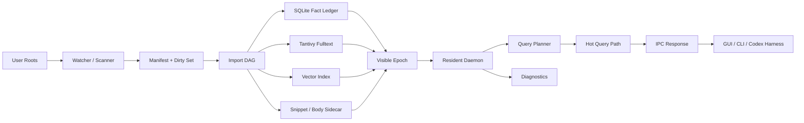

# 系统架构与模块边界

## 1. 总体架构



## 2. 目标模块

| 模块 | 责任 | 禁止事项 |
|---|---|---|
| `fs-crawler` | 文件发现、规范化、stable file identity、dirty subtree 输入 | 不解析正文，不写索引 |
| `meta-store` | SQLite fact ledger、manifest、batch、epoch、job state、diagnostics aggregate | 不直接运行 OCR/vector，不隐藏失败状态 |
| `import-pipeline` | discover/classify/fingerprint/parse/normalize/field extract 的 DAG 编排 | 不阻塞热查询，不把 OCR/semantic 放到首轮可见路径 |
| `index-fulltext` | Tantivy schema、append-only segment、fast fields、query execution、snippet pointer | 不把大正文作为热路径 STORED 字段 |
| `index-vector` | semantic layer、hot overlay、cold base、query embedding cache | 不默认强制 semantic，不影响 keyword/field 可用性 |
| `rank-fusion` | BM25/vector/field/freshness fusion、candidate budget、partial 标记 | 不做 SQLite 逐条 hydrate |
| `search-planner` | query parser、bucket strategy、filter plan、candidate limit | 不依赖 GUI 状态，不读取私有 query trace |
| `daemon` | resident query service、IPC、reader/cache lifetime、task budgets、diagnostics | 不暴露内部路径和 raw data |
| `cli` | automation surface、private benchmark commands、diagnostics/export | 不打印 raw query、resume path、trace text |
| GUI | 本地操作界面、手工验证入口、状态/搜索/详情/诊断 | 不直接读写内部存储 |

## 3. 关键边界

### 3.1 数据事实边界

SQLite 是事实账本。Tantivy、vector、snippet/body sidecar 都是派生状态。派生状态损坏时，系统应从 SQLite manifest/batch/epoch 恢复或局部重建。

### 3.2 查询边界

热查询路径只读当前 visible epoch：

```text
parse query -> plan filters -> bitmap/fast-field prefilter -> BM25/optional ANN -> fusion -> bulk hydrate -> snippet -> response
```

### 3.3 GUI 边界

GUI 只能使用 daemon IPC：

1. `status`
2. `import`
3. `search`
4. `detail`
5. `pause/resume/cancel`
6. `diagnostics/export`
7. `benchmark/status`

GUI 不拥有业务事实，不创建隐式状态。

## 4. 现有风险点

1. `crates/cli/src/main.rs` 是大 composition root。下一阶段只能在 touched scope 内拆分，不能进行无目标重构。
2. `crates/meta-store/src/lib.rs` 承担大量 schema、query、job、candidate、index state 逻辑。任何数据模型 breaking change 必须先写 `s3_sqlite` focused red test。
3. `crates/daemon/src/main.rs` 是 IPC、import worker、search worker 的交汇点。daemon contract 要先版本化，再改内部。
