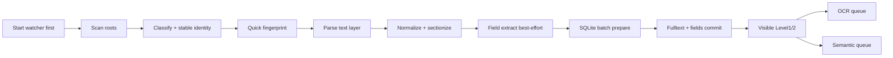
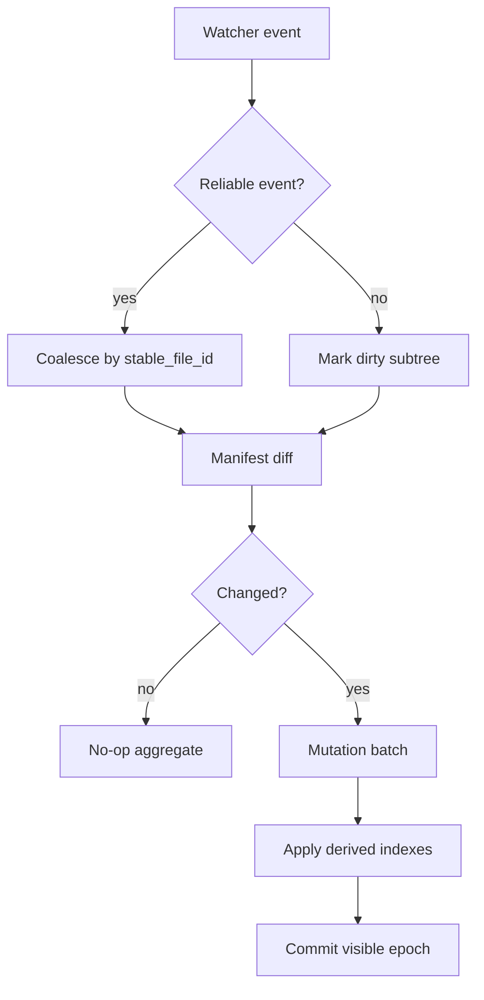
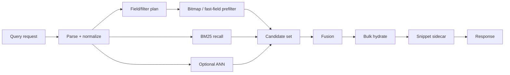

# 数据流与状态机

## 1. 首次导入快模式

快模式目标是先让可解析文本进入可搜索状态。OCR 和 semantic 是后台增强，不阻塞 Level1/2 可见性。

## 2. 增量更新

零变更增量的验收重点是：重解析数接近 0，full rebuild 不发生。

## 3. 查询路径

字段过滤必须先于重排序执行。禁止 BM25 topK 后逐条 SQLite hydrate 再过滤。

## 4. Level 可见性

| Level | 含义 | 用户可见能力 |
|---|---|---|
| Level1 | 文件和基础元数据可见 | GUI 看到文件已发现、状态可查 |
| Level2 | 文本层全文可搜 | keyword、filename、基础 snippet 可用 |
| Level3 | 字段/semantic/OCR 增强完成或部分完成 | filter、hybrid、semantic、OCR 内容逐步增强 |

GUI 必须明确展示 Level，而不是把“导入完成”误写成“所有 OCR/semantic 完成”。

## 5. 后台预算状态

| 状态 | 触发 | 动作 |
|---|---|---|
| `interactive` | 用户正在查询或 GUI 活跃 | 降低 OCR/vector/merge |
| `balanced` | 默认接电/SSD/资源正常 | 常规后台吞吐 |
| `energy_saver` | 电池、热、低内存、HDD | 暂停 OCR/vector，保留查询 |
| `repair` | 检测到派生状态缺失或损坏 | 局部 rebuild，不全库重建 |
