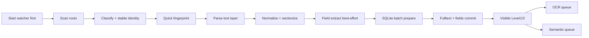
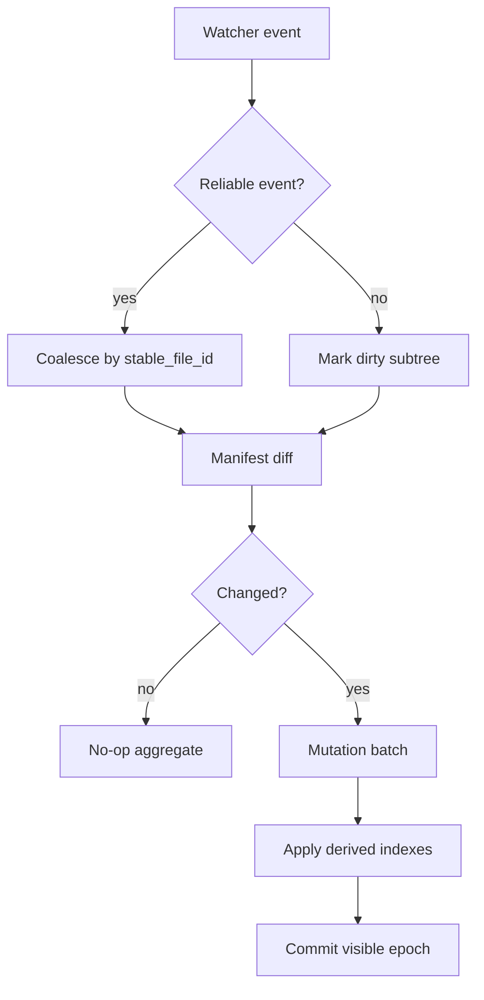
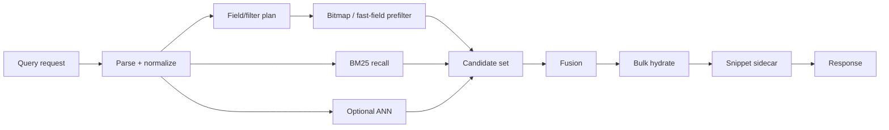

# 数据流与状态机

## 1. 首次导入快模式

快模式目标是先让可解析文本进入可搜索状态。OCR 和 semantic 是后台增强，不阻塞 Level1/2 可见性。

## 2. 增量更新

零变更增量的验收重点是：重解析数接近 0，full rebuild 不发生。

## 3. 查询路径

字段过滤必须先于重排序执行。禁止 BM25 topK 后逐条 SQLite hydrate 再过滤。

## 4. Level 可见性

| Level | 含义 | 用户可见能力 |
|---|---|---|
| Level1 | 文件和基础元数据可见 | GUI 看到文件已发现、状态可查 |
| Level2 | 文本层全文可搜 | keyword、filename、基础 snippet 可用 |
| Level3 | 字段/semantic/OCR 增强完成或部分完成 | filter、hybrid、semantic、OCR 内容逐步增强 |

GUI 必须明确展示 Level，而不是把“导入完成”误写成“所有 OCR/semantic 完成”。

## 5. 后台预算状态

| 状态 | 触发 | 动作 |
|---|---|---|
| `interactive` | 用户正在查询或 GUI 活跃 | 降低 OCR/vector/merge |
| `balanced` | 默认接电/SSD/资源正常 | 常规后台吞吐 |
| `energy_saver` | 电池、热、低内存、HDD | 暂停 OCR/vector，保留查询 |
| `repair` | 检测到派生状态缺失或损坏 | 局部 rebuild，不全库重建 |

## 6. Adaptive Governor Contract

低配和节能模式必须由可观测信号驱动，不允许只写成“后台降级”口号。

| Signal | Threshold | Action | Recovery |
|---|---|---|---|
| interactive latency | P95 > 200ms 连续 3 个 10s window | OCR/vector/import 并发减半，benchmark 降速 | P95 <= 150ms 连续 6 个 window |
| interactive overload | P95 > 400ms 或 queue delay > 200ms | 暂停 benchmark/background，必要时返回 partial/`OVERLOADED` | 6 个 window 正常且 dwell >= 60s |
| RSS / memory pressure | daemon RSS > 2048MB 或系统 memory pressure elevated | 清低优先级 cache、暂停 heavy background、保留 resident reader | RSS 回到预算内 6 个 window |
| page fault / disk stall | major faults > 100/s 或 fsync P95 > 100ms | 暂停 compaction/snapshot/import 大批次，禁止整包 publish | IO 指标恢复 6 个 window |
| battery / thermal | battery < 20% 或 thermal serious | 进入 `energy_saver`，只保留必要 indexing 和前台查询 | 接电或 thermal normal，dwell >= 60s |
| HDD / slow media | 随机读写或 fsync latency 超阈值 | 减小 batch、延后 vector/OCR、优先 manifest diff | media 指标恢复 6 个 window |

每次状态切换必须进入 daemon status、redacted diagnostics 和 GUI 可见原因，并进入 W1/soak evidence 的 resource aggregate。阈值源文件是 `perf/acceptance-matrix.toml`；实现期如需调整，必须改矩阵并重新 review，不能在代码中静默漂移。

## 7. Loop Engineering 绑定

产品状态机只描述导入、索引、查询和后台预算状态。长程 Codex 执行状态由 `13_Loop_Engineering状态机.md` 约束。

任何后续切片在进入实现前必须声明：

1. 当前 Loop state。
2. active goal id。
3. 本切片允许文件。
4. 本切片验收命令。
5. 本切片证据 lane。

若上述信息缺失，禁止开始实现。
