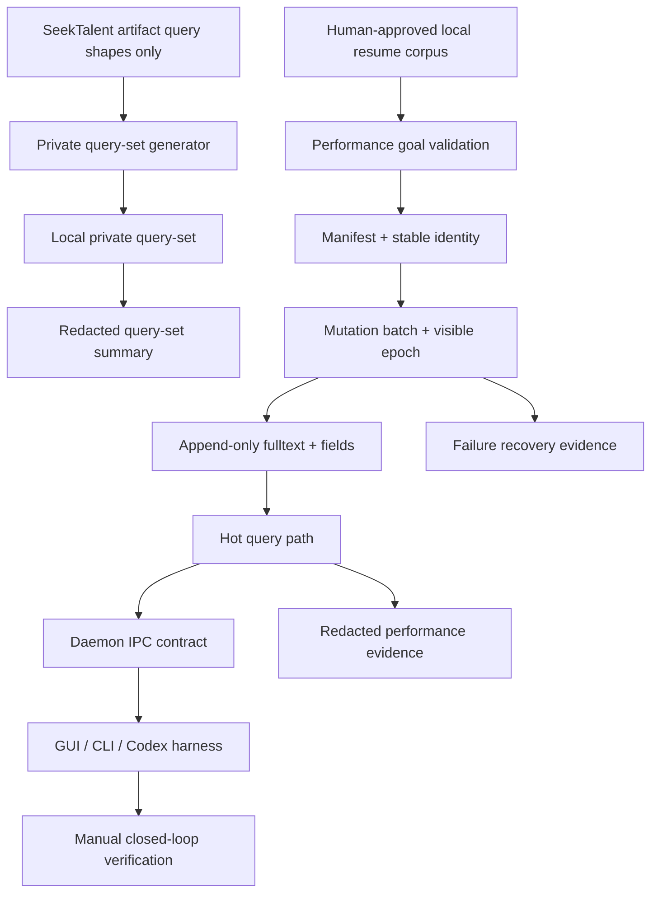

# 一页版目标图



## 目标口径

```text
不是：把所有功能同步做完再可搜。
而是：文件先可见，文本先可搜，字段和 semantic 后台增强，失败可见，证据可复现。
```

## 最重要的红线

1. raw query 不进 repo。
2. raw resume 不进 repo。
3. GUI 不直连内部存储。
4. 热路径不做 OCR/解析/重模型推理。
5. performance 结果不混淆 smoke 和 full baseline。
6. P0 contract 先于性能实现。
7. Loop Engineering state machine 防止目标漂移。
8. Query semantics 固定后才允许优化。
9. Daemon IPC/diagnostics versioned contract 先于 GUI。
10. W0/W1/soak/fault/GUI evidence lane 分离。
